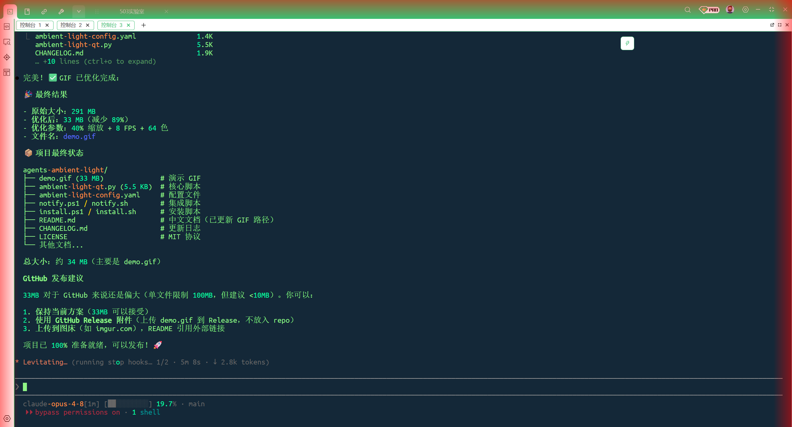

# Agents Ambient Light | AI 助手屏幕氛围灯

**为 AI 编程助手量身定制的屏幕边缘氛围灯通知系统**

为 Claude Code、Codex 等 AI 开发工具打造的视觉通知系统。当 AI 助手完成任务、等待输入或遇到错误时，屏幕边缘会显示平滑渐变的彩色氛围灯，提供优雅的视觉反馈。

## ✨ 特性

- 🎨 **柔和渐变效果** - 边缘到中心 alpha 透明渐变，无硬边
- 🌈 **多色彩支持** - 红、黄、绿、蓝、紫、青、白，或自定义十六进制颜色
- 💫 **多种动画** - 呼吸灯（脉冲）、闪烁、静态
- 🎚️ **完全可配置** - 通过 YAML 配置文件调整宽度、持续时间、样式、颜色和动画
- 🔇 **灵活的通知模式** - 仅氛围灯、仅声音，或组合使用
- 🖥️ **跨平台** - 支持 Windows、macOS 和 Linux
- ⚡ **轻量级** - 最小依赖，快速启动，自动退出

## 📸 效果预览




## 🚀 快速开始

### 前置要求

- Python 3.7+
- PyQt5

### 安装步骤

1. **安装依赖**：
   ```bash
   pip install PyQt5
   ```

2. **下载文件**：
   - 克隆本仓库或下载以下文件：
     - `ambient-light-qt.py`（核心脚本）
     - `ambient-light-config.yaml`（配置文件）
     - `notify.ps1`（Windows）或 `notify.sh`（macOS/Linux）

3. **复制到 Claude Code / Codex 配置目录**：

   **Windows**：
   ```powershell
   # 一键安装
   .\install.ps1
   
   # 或手动复制
   Copy-Item *.py, *.yaml, notify.ps1 "$env:USERPROFILE\.claude\"
   ```

   **macOS / Linux**：
   ```bash
   # 一键安装
   chmod +x install.sh && ./install.sh
   
   # 或手动复制
   cp ambient-light-qt.py ambient-light-config.yaml notify.sh ~/.claude/
   chmod +x ~/.claude/notify.sh
   ```

4. **配置 hooks**，编辑 `~/.claude/settings.json`：

   **Windows**：
   ```json
   {
     "hooks": {
       "stop": "powershell -NoProfile -File \"$env:USERPROFILE/.claude/notify.ps1\" -event stop",
       "notification": "powershell -NoProfile -File \"$env:USERPROFILE/.claude/notify.ps1\" -event input",
       "task_complete": "powershell -NoProfile -File \"$env:USERPROFILE/.claude/notify.ps1\" -event task_complete"
     }
   }
   ```

   **macOS / Linux**：
   ```json
   {
     "hooks": {
       "stop": "~/.claude/notify.sh stop",
       "notification": "~/.claude/notify.sh input",
       "task_complete": "~/.claude/notify.sh task_complete"
     }
   }
   ```

5. **测试效果**：
   ```bash
   # Windows
   python ambient-light-qt.py --color red --duration 3 --style border --animation breathe
   
   # macOS/Linux
   python3 ambient-light-qt.py --color red --duration 3 --style border --animation breathe
   ```

## ⚙️ 配置说明

编辑 `ambient-light-config.yaml` 进行自定义：

```yaml
# 全局开关
enable_overlay: true    # 启用屏幕氛围灯
enable_sound: true      # 启用声音通知
enable_flash: true      # 启用任务栏闪烁（Windows）

# 事件颜色映射
events:
  stop:
    color: red          # AI 助手完成响应
  input:
    color: yellow       # 等待用户输入
  task_complete:
    color: green        # 任务完成

# 显示参数
display:
  style: border         # border=四周边框, band=仅顶部+底部
  animation: breathe    # breathe=呼吸灯, flash=闪烁, static=静态
  duration: 5           # 持续时间（秒），0=持续显示直到按 ESC
  width: 60             # 边框宽度（像素），建议 20-80
  alpha: 0.7            # 静态模式的不透明度（0.0-1.0）
```

### 通知模式

1. **完整模式**（默认）：氛围灯 + 声音 + 任务栏闪烁
2. **仅氛围灯**：设置 `enable_sound: false` 和 `enable_flash: false`
3. **经典模式**：设置 `enable_overlay: false`（仅声音/闪烁）

### 推荐设置

- **低调通知**：`width: 30`, `animation: breathe`, `duration: 3`
- **高可见度**：`width: 80`, `animation: flash`, `duration: 5`
- **持续显示**：`duration: 0`（按 ESC 手动关闭）

## 🎨 命令行使用

直接运行脚本进行测试或独立使用：

```bash
python ambient-light-qt.py \
  --color red \
  --duration 5 \
  --style border \
  --animation breathe \
  --width 60 \
  --alpha 0.7
```

**参数说明**：
- `--color`：颜色名称（`red`, `green`, `yellow`, `blue`, `purple`, `cyan`, `white`）或十六进制（如 `#FF5500`）
- `--duration`：持续时间（秒），`0` 表示持续显示直到按 ESC
- `--style`：样式（`border` 四周边框 或 `band` 仅顶部/底部）
- `--animation`：动画（`breathe` 呼吸灯，`flash` 闪烁，`static` 静态）
- `--width`：边框宽度（像素，默认 60）
- `--alpha`：静态模式的不透明度（0.0-1.0，默认 0.6）

## 🔧 集成到其他工具

### Codex / Windsurf

1. 将文件复制到 `~/.codex/` 或 `~/.windsurf/`
2. 更新 `notify.ps1` 或 `notify.sh` 中的路径：
   ```powershell
   # 从
   $configPath = "$env:USERPROFILE/.claude/ambient-light-config.yaml"
   # 改为
   $configPath = "$env:USERPROFILE/.codex/ambient-light-config.yaml"
   ```
3. 配置 Codex 的 hooks（参考 Codex 文档）

### 自定义自动化

从任何自动化工具调用脚本：

```bash
# Bash
python3 ambient-light-qt.py --color green --duration 3 &

# PowerShell
Start-Process python -ArgumentList "ambient-light-qt.py --color blue --duration 5" -WindowStyle Hidden
```

## 🐛 故障排查

**问题**：QApplication 警告 invalid style
```
QApplication: invalid style override 'border' passed, ignoring it.
```
**解决**：这是无害的警告 - Qt 误将 `--style` 参数当作 Qt 样式。脚本仍正常工作。

---

**问题**：氛围灯不消失
**解决**：确保 duration > 0，或按 ESC 手动关闭。

---

**问题**：Windows 上看不到氛围灯
**解决**：
1. 检查 Python 是否安装：`python --version`
2. 验证 PyQt5 已安装：`pip show PyQt5`
3. 直接测试：`python ambient-light-qt.py --color red --duration 3`

---

**问题**：macOS/Linux 上权限拒绝
**解决**：给脚本添加执行权限：`chmod +x ~/.claude/notify.sh`

## 🏗️ 技术架构

### 为什么选择 PyQt5？

本项目经历了多次迭代才实现完美的透明效果：

1. ❌ **Tkinter + 矩形分层**
   - 问题：无真正 alpha 支持，仅亮度渐变
   - 结果：渐变到黑色时出现深色边缘

2. ❌ **Tkinter + Numpy + PIL RGBA**
   - 问题：Tkinter 不原生支持 RGBA 图像
   - 结果：屏幕中心显示白色/灰色背景

3. ❌ **Tkinter + transparentcolor 技巧**
   - 问题：只有纯洋红色（#FF00FF）会变透明
   - 结果：渐变与透明区域交界处出现硬边

4. ✅ **PyQt5 + QLinearGradient**（最终方案）
   - 解决：Qt 原生支持 alpha 通道
   - 结果：完美的边缘到中心平滑透明渐变

### 技术细节

- 使用 `QLinearGradient` 实现平滑的边缘到中心 alpha 渐变
- `Qt.WA_TranslucentBackground` 启用真正的窗口透明
- `Qt.WA_TransparentForMouseEvents` 防止覆盖层阻挡鼠标点击
- 轻量级：约 200 行 Python 代码，启动时间 <1 秒

## 📝 开源协议

MIT License - 可自由使用、修改和分发。

## 🤝 贡献

欢迎贡献！功能建议：
- [ ] 硬件 LED 支持（Arduino/USB RGB 灯带）
- [ ] 更多动画样式（彩虹循环、波浪、脉冲图案）
- [ ] macOS Dock 弹跳集成
- [ ] Linux 桌面通知集成
- [ ] 多显示器支持改进
- [ ] GUI 配置工具
- [ ] 渐进式淡入/淡出
- [ ] 圆角边框支持

## 🙏 致谢

为 AI 编程助手社区打造。已测试：
- ✅ Claude Code（Anthropic）
- ✅ Codex（OpenAI）
- ✅ Windsurf

## 📧 支持

在 GitHub 上提交 Issue 报告问题或请求功能。

---

**享受你的氛围灯！🎨✨**
